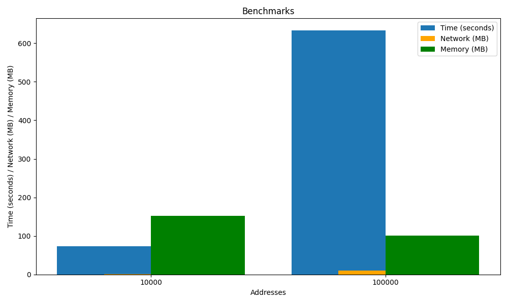
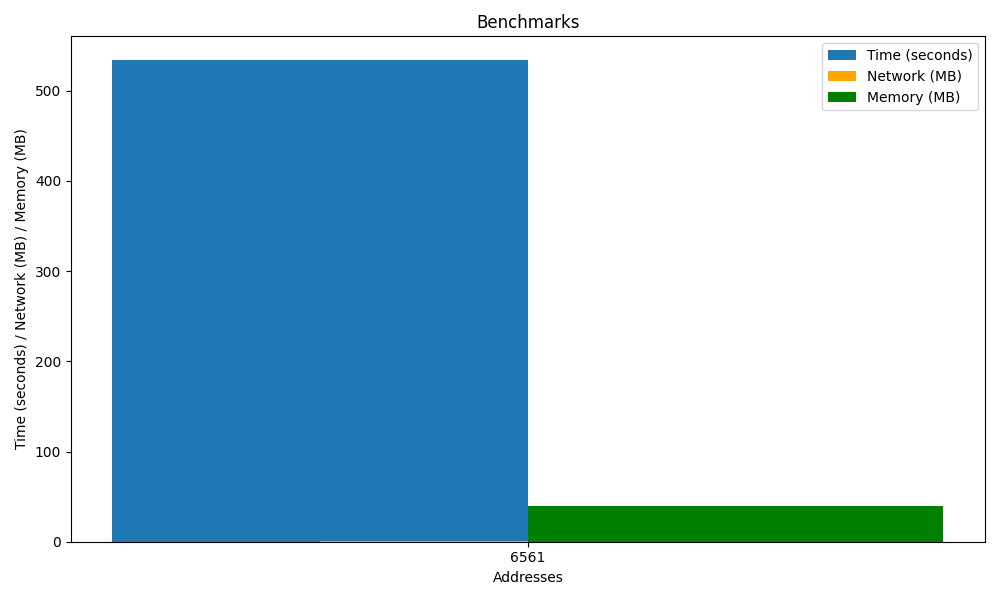

# Pinging the internet
Inspired by [Tom7's Harder Drive](http://tom7.org/harder/) project, this repo provides the utilities to ping every IP address in the IPv4 address space.

## Table of Contents
* [TODO](#todo)
* [Create IP List](#create-ip-list)
  * [Exponential Range](#exponential-range)
  * [Ordered Range](#ordered-range)
* [Pinging IPs](#pinging-ips)
* [Docker](#docker)
  * [Creating image](#creating-image)
  * [Running image](#running-image)
* [Image Output](#image-output)
  * [Active Spaces](#active-spaces)
  * [Dead Spaces](#dead-spaces)
* [Benchmarks](#benchmarks)
  * [Active Spaces Bench](#active-space-benchmarks)
  * [Dead Spaces Bench](#dead-space-benchmarks)

## TODO
- [ ] [Algorithm to determine optimal number of threads.](https://github.com/kevinmuscara/internet/issues/1)
- [ ] [Modify Docker implementation.](https://github.com/kevinmuscara/internet/issues/2)
- [ ] [Live Benchmarks.](https://github.com/kevinmuscara/internet/issues/3)
- [ ] [Network and Memory performance accuracy.](https://github.com/kevinmuscara/internet/issues/4)

## Create IP List
There are 2^32 possible IP addresses, or around 4.2 billion addresses. The output list will be stored in `ip_list.txt`.

### Exponential Range
To skip addresses and create a list within a range of `range^4`, use the `generate_ip_list.py` script:

```shell
sudo python3 generate_ip_list.py <range>
```

Provide a 0-256 range value.
**NOTE: This script requires elevated privilages to write to the output file**

Example Usage:
```shell
sudo python3 generate_ip_list.py 1
```

Output:
```
0.0.0.0
```

### Ordered Range
To create an IP list between a defined IP range, use the `generate_ip_range.py` script:

```shell
sudo python3 generate_ip_range.py <start_range> <end_range>
```

Provide a start and end range between `0.0.0.0` to `255.255.255.255`.

Example Usage:
```shell
sudo python3 generate_ip_range.py 0.0.0.0 0.0.0.5
```

Output:
```
0.0.0.0
0.0.0.1
0.0.0.2
0.0.0.3
0.0.0.4
0.0.0.5
```

## Pinging IPs
All responses will output to `icmp_responses.txt`. See the sample output below.
**NOTE: Sending ICMP echo requires elevated permissions, use sudo**

`1` is alive, `0` is dead.

```
0.0.0.0,0
0.0.0.1,0
0.0.1.0,0
0.0.1.1,0
0.1.0.0,0
0.1.0.1,0
0.1.1.0,0
0.1.1.1,0
1.0.0.0,0
1.0.0.1,1
1.0.1.0,0
1.0.1.1,0
1.1.0.0,0
1.1.0.1,0
1.1.1.0,1
1.1.1.1,1
```

Run with the following command:

```shell
sudo python3 ping.py
```

## Docker
To run the process in docker, follow the steps below.

### Creating image
To create the image, run the build process by running:

```shell
docker build -t pingy .
```

### Running image
To run the image after building it, run the following command:

```shell
docker run -d pingy
```

## Image Output
To view the results as a bitmap image with black pixels representing dead hosts, and white pixels representing alive hosts, use the `create_map.py` script:

**NOTE: If you run this with elevated privilages, you will get permission issues viewing the image.**

```shell
python3 bitmaps/create_map.py
```

View the sample outputs below:

### Active Spaces
Active spaces are ranges that are most populated, returning in active responses.

1. 104.16.181.0 - 104.16.220.15 (10,000 Addresses)


2. 104.16.181.0 - 104.18.59.159 (100,000 Addresses)


### Dead Spaces
Dead spaces are ranges that aren't commonly populated, returning minimal responses.


### Active Space Benchmarks
Benchmarks from [Active Spaces](#active-spaces)

Addresses | Time (seconds) | Network (bytes) | Network (MB) | Memory (bytes) | Memory (MB)
----------|----------------|-----------------|--------------|----------------|------------
10,000    | 73.40          | 1025024         | 1.025        | 152223744      | 152.22
100,000   | 632.77         | 10585088        | 10.59        | 100925440      | 100.93



### Dead Space Benchmarks
Benchmarks from [Dead Spaces](#dead-spaces)

Addresses | Time (seconds) | Network (bytes) | Network (MB) | Memory (bytes) | Memory (MB)
----------|----------------|-----------------|--------------|----------------|------------
6,561     | 533.64         | 1108992         | 1.11         | 39305216       | 39.31 

